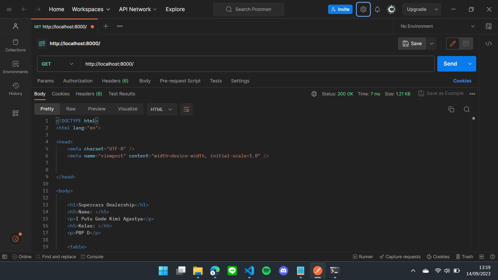
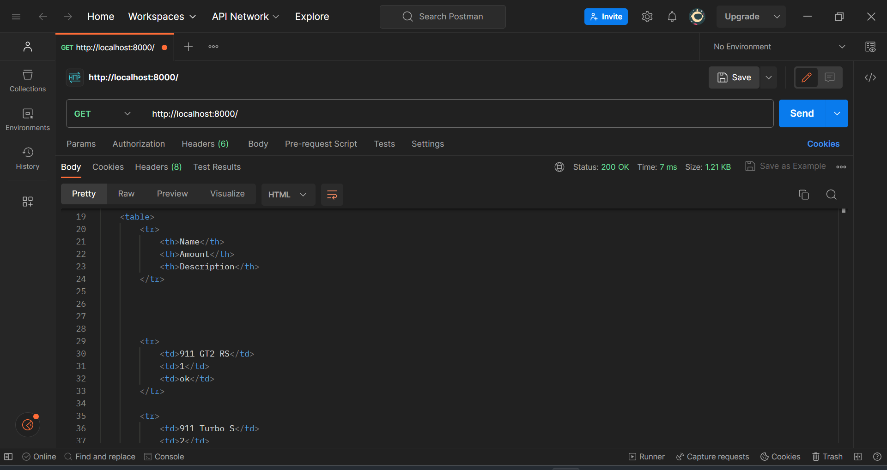
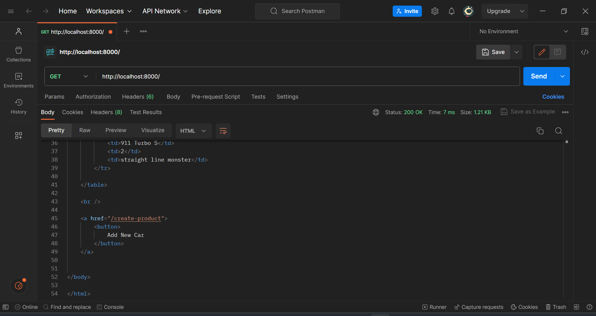
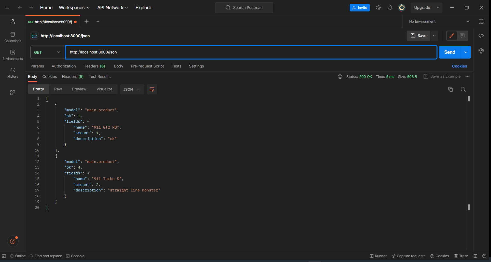
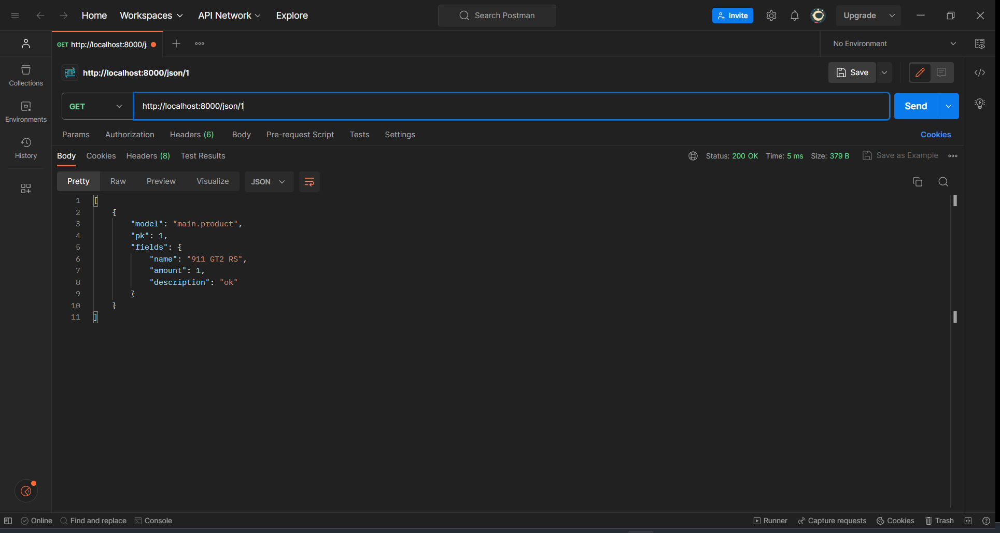
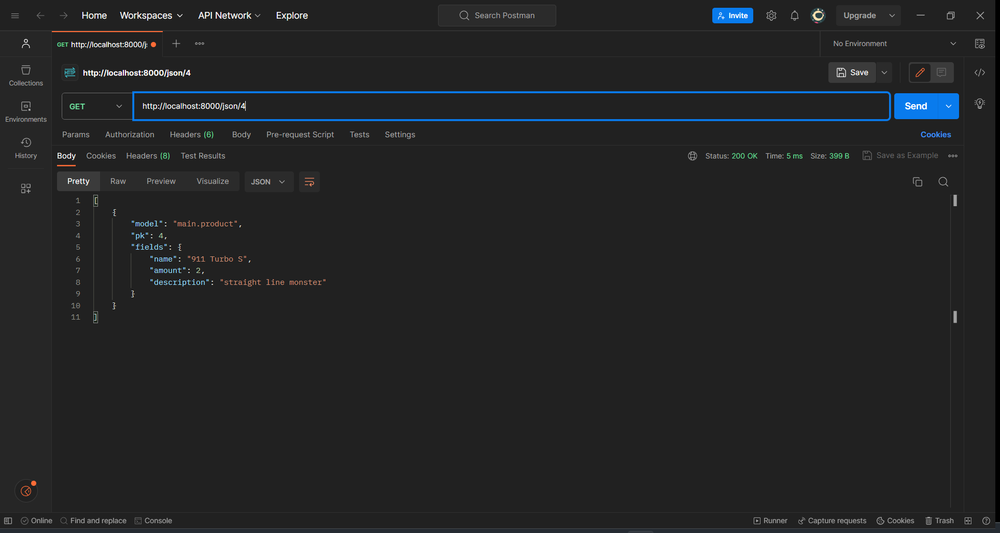
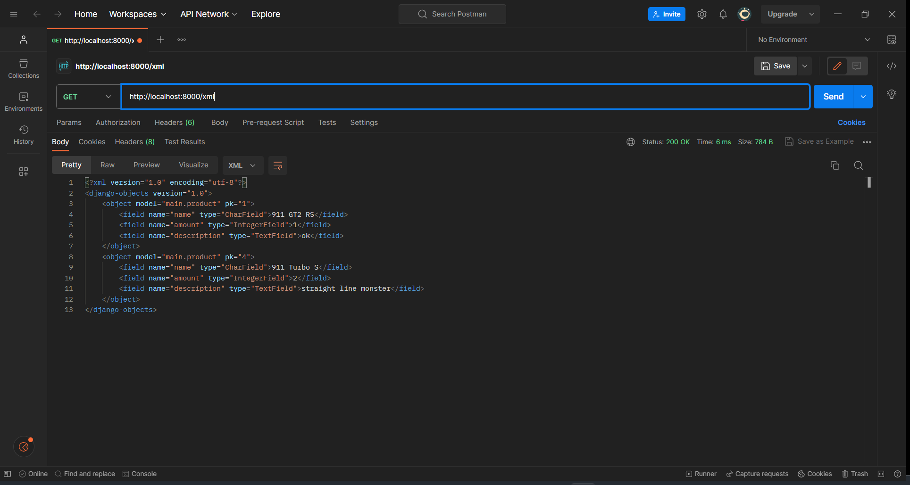
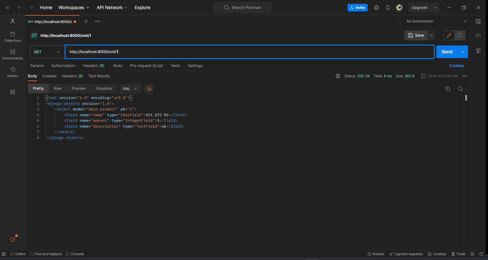
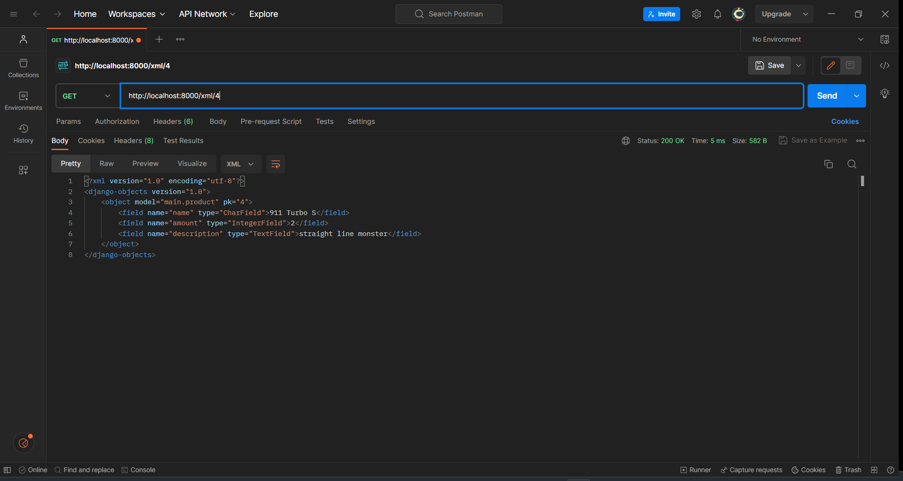

<h3>Tugas 5</h3>

 1. Jelaskan manfaat dari setiap element selector dan kapan waktu yang tepat untuk menggunakannya. <br>
    1. Element selector digunakan untuk memilih dan mendesain semua elemen yang sama, misalnya semua elemen &lt;h1&gt; di dalam halaman web. Cocok digunakan jika suatu elemen sudah ditentukan peruntukannya sehingga desainnya konsisten.
    2. ID selector digunakan untuk memilih dan mendesain elemen yang berada di dalam tag yang memiliki ID tertentu. Cocok digunakan saat ingin menetapkan aturan desain tertentu pada elemen HTML yang memiliki ID unik.
    3. Class selector digunakan untuk memilih dan mendesain elemen-elemen yang berada di dalam tag yang memiliki class tertentu, biasanya pada tag div. Class tidak bersifat unik seperti ID, sehingga cocok digunakan saat ingin menggunakan selector yang sama pada beberapa elemen di suatu halaman web.
    
 2. Jelaskan HTML5 Tag yang kamu ketahui. <br>
    - &lt;nav&gt; : tag yang mendefinisikan sekumpulan link navigasi, contohnya pada navbar. Tag ini tidak harus berada pada setiap link navigasi, hanya gunakan tag ini pada bagian website yang memiliki sekumpulan link navigasi.
      ```html
      <nav>
        <a href="/home/">Home</a>
        <a href="/pricing/">Pricing</a>
        <a href="/about/">About</a>
        <a href="/contact/">Contact Us</a>
      </nav>
      ```
    - &lt;video&gt; : tag yang digunakan untuk menambahkan konten video. Tag ini dapat berisi satu atau lebih atribut &lt;source&gt; yang akan dipilih sesuai format yang di-support oleh browser.
      ```html
      <video>
        <source src="profile.mp4" type="video/mp4">
      </video>
      ```
    - &lt;header&gt; : tag yang digunakan untuk menampilkan konten awal/paling atas dalam halaman web. Tag ini biasanya berisi elemen heading, logo website, paragraf, dan lainnya.
      ```html
      <header>
        <h1>Supercar Dealership</h1>
        <p>dibuat oleh Kimi</p>
      </header>
      ```

 3. Jelaskan perbedaan antara margin dan padding. <br>
    Margin adalah ruang di sekitar suatu elemen yang berada di luar border elemen tersebut. Margin digunakan untuk mengatur jarak antar elemen, contohnya untuk mengatur jarak antar dua elemen image. Padding adalah ruang di antara border elemen dengan konten-konten di dalam elemen tersebut. Padding digunakan untuk mengatur jarak konten di dalam elemen dengan bordernya. <br>
 4. Jelaskan perbedaan antara framework CSS Tailwind dan Bootstrap. Kapan sebaiknya kita menggunakan Bootstrap daripada Tailwind, dan sebaliknya? <br>
    Bootstrap: <br>
    - Bootstrap menyediakan template CSS yang mengutamakan desain yang responsif dan mobile-first.
    - Template Bootstrap sudah pre-designed sehingga desainnya konsisten.
    - Bootstrap memiliki file yang berukuran besar.
    <br>
    Kapan menggunakan Bootstrap? <br>
    - Developer membutuhkan framework desain web lengkap dengan style yang default.
    - Developer ingin menggunakan framework desain yang mudah dipelajari.
    - Website perlu di-develop dengan cepat.
    <br>
    <br>
    Tailwind: <br>
    - Tailwind tidak menyediakan komponen yang pre-designed.
    - Tailwind menyediakan kelas-kelas utilitas desain yang digunakan untuk membangun tampilan website.
    - Tailwind memiliki file yang berukuran kecil karena hanya berisi kelas-kelas utilitas yang ada.
    <br>
    Kapan menggunakan Tailwind?<br>
    - Developer membutuhkan desain yang ringan untuk diimplementasikan.
    - Developer membutuhkan framework desain yang fleksibel dan mudah untuk dikustomisasi.
    - Developer membutuhkan framework desain yang memiliki kontrol penuh terhadap desain setiap elemennya.

 5. Jelaskan bagaimana cara kamu mengimplementasikan checklist di atas secara step-by-step (bukan hanya sekadar mengikuti tutorial).
    Saya memilih framework CSS Bootstrap pada tugas 5 ini. Pertama-tama saya menambahkan Bootstrap ke aplikasi Django saya dengan menambahkan tag link serta atribut href dan tag script serta atribut src sesuai dengan dokumentasi Bootstrap pada file base.html di folder templates. Halaman login saya kustomisasi dengan memodifikasi file `login.html` dengan menambahkan header yang memberikan penjelasan tambahan mengenai website saya. Kemudian, saya membuat layout dua kolom dengan kolom sebelah kiri berisi form login dan kolom sebelah kanan berisi foto yang seakan-akan menggambarkan interior dealership. Saya juga melakukan hal yang mirip pada halaman register dan tambah inventori dengan header dan foto yang disesuaikan dengan halamannya. Pada halaman daftar inventori, saya melakukan beberapa hal. Pertama, saya menambahkan navbar yang diambil dari Bootstrap. Pada navbar tersebut saya isi dengan logo, kalimat welcome yang disesuaikan dengan username yang login, tombol "Add New Car" dan tombol logout. Setelah navbar, saya menambahkan jumbotron yang berisi kalimat pembuka mengenai promosi dealership. Perubahan selanjutnya adalah data yang disubmit tidak lagi ditampilkan dalam bentuk tabel, tetapi dengan menggunakan cards dari Bootstrap. Saya mengubah for loop pada file `main.html` dengan menghapus baris kode yang berkaitan dengan tabel dengan cards, kemudian, masih di dalalm loop, masing-masing card diisi dengan nama, stok, serta deskripsinya. Di dalam setiap card juga diisi dengan tombol edit dan delete. terakhir untuk bonus, saya menambahkan baris kode conditionals pada loop jika produk yang ditampilkan terakhir memiliki warna teks yang berbeda.

<h3>Tugas 4</h3>
 
 1. Apa itu Django UserCreationForm, dan jelaskan apa kelebihan dan kekurangannya? <br>
    Django `UserCreationForm` adalah form yang bertugas untuk mendaftarkan user baru ke dalam aplikasi kita.<br>
    Kelebihan:
    - UserCreationForm merupakan fitur bawaan Django yang siap digunakan sehingga dapat menghemat waktu dalam pembuatan aplikasi
    - UserCreationForm dapat diimplementasikan pada app yang berbeda dari project sehingga memungkinkan untuk membuat sebuah app yang bertugas sepenuhnya untuk membuat user baru.
    - UserCreationForm mendukung validasi input, seperti kesesuaian ketentuan username dan kesesuaian antara field "Password" dan "Password confirmation".<br>

    Kekurangan:
    - Hanya terdapat field username dan password. Jika ingin menambahkan field baru (seperti e-mail), maka harus memodifikasi UserCreationForm dengan menambahkan field serta validasi inputnya, atau dengan membuat form registrasi dari awal tanpa menggunakan UserCreationForm.

 2. Apa perbedaan antara autentikasi dan otorisasi dalam konteks Django, dan mengapa keduanya penting? <br>
    Autentikasi merupakan proses untuk memverifikasi identitas user dengan mengecek username dan passwordnya dengan data yang tersimpan di dalam database. Jika verifikasi sukses, maka sistem akan mengonfirmasi keabsahan user. Otorisasi adalah proses menentukan apa saja yang bisa dan tidak bisa dilakukan oleh user dengan mengecek apakah suatu user punya izin untuk mengakses atau melakukan sesuatu. <br>
    Keduanya penting untuk menjaga data sensitif agar tidak dapat dilihat dan disalahgunakan oleh sembarang user. Autentikasi dan otorisasi juga dapat memudahkan kita untuk memantau aktivitas user dengan mengetahui siapa user yang melakukan suatu hal di dalam sistem.

 3. Apa itu cookies dalam konteks aplikasi web, dan bagaimana Django menggunakan cookies untuk mengelola data sesi pengguna? <br>
    Cookies adalah sebuah text file berukuran kecil yang menyimpan data seperti username dan password yang digunakan untuk mengidentifikasi komputer yang kita gunakan untuk mengakses sebuah website. Django menggunakan cookies sebagai bagian dari session management system. Ketika seorang user melakukan login, Django akan meletakkan session ID cookie pada client dan meletakkan session data pada server. Dengan itu, maka hanya session ID yang dapat dilihat oleh user, sedangkan session data aman tersembunyi di dalam server.

 4. Apakah penggunaan cookies aman secara default dalam pengembangan web, atau apakah ada risiko potensial yang harus diwaspadai? <br>
    Ada beberapa risiko potensial yang harus diwaspadai dalam menggunakan cookies: <br>
    - Jika terjadi penyerangan pada situs web, cookies bisa terekspos oleh penyerang
    - Potensi terjadinya Cross-Site Scripting, yang dapat terjadi ketika script berbahaya dimasukkan ke dalam situs web yang dapat digunakan untuk mencuri informasi sensitif seperti session token
    - Potensi terjadinya session fixation, yaitu serangan yang memungkinkan penyerang membajak sesi user.<br>

 5. Jelaskan bagaimana cara kamu mengimplementasikan checklist di atas secara step-by-step (bukan hanya sekadar mengikuti tutorial).
    * Mengimplementasikan fungsi registrasi, login, dan logout: <br>
      Pertama-tama saya menambahkan beberapa modul yang dibutuhkan pada file `views.py`, seperti `UserCreationForm` untuk registrasi user baru, `authenticate` untuk mengautentikasi user terdaftar yang ingin login, serta modul `logout`.
      <br>
      <br>
      Selanjutnya, pada file yang sama, saya membuat functionnya masing-masing. Function `register` dibuat untuk menghasilkan form registrasi secara otomatis dan membuat user baru. Function `login` berfungsi untuk mengautentikasi user yang ingin login. Function `logout` berfungsi untuk menghapus sesi user saat itu dan mengarahkan ke halaman login.
      <br>
      <br>
      Kemudian, saya membuat file HTML baru untuk register dan login yang saya letakkan di direktori main/templates yang kemudian saya tambahkan path url nya pada file `urls.py`. Saya juga menambahkan tombol logout pada file `main.html` untuk melakukan proses logout.
      <br>
      <br>
      Terakhir, saya membatasi akses halaman main supaya user harus login terlebih dahulu. Saya import modul `login_required` pada `views.py` dan menambahkan kode `@login_required(login_url='/login')` di atas function `show_main` supaya halaman main hanya bisa diakses oleh user yang telah login.
      <br>
      <br>

    * Menampilkan detail informasi pengguna yang sedang logged in seperti username dan menerapkan cookies seperti last login pada halaman utama aplikasi: <br>
      Pertama-tama saya menambahkan beberapa modul yang dibutuhkan pada file `views.py`, yaitu `HttpResponseRedirect`, `reverse`, dan `datetime`. Pada file yang sama, saya menambahkan cookies `last_login` pada fungsi `login_user` untuk menampilkan waktu saat user login. Variabel `context` pada fungsi `show_main` ditambah dengan `'last_login': request.COOKIES['last_login']` untuk menambahkan informasi `last_login`. Fungsi `logout_user` dimodifikasi agar cookies dihapus ketika user logout. Pada file `main.html` ditambahkan kode untuk menampilkan waktu user login.
      <br>
      <br>
      Selanjutnya, saya memodifikasi file `models.py` dengan mengimport modul `User` dan menambahkan kode `user = models.ForeignKey(User, on_delete=models.CASCADE)` untuk menghubungkan product dengan user. Kemudian saya memodifikasi function `create_product` pada file `views.py` agar objek yang dibuat tidak langsung disimpan ke database. Fungsi `show_main` juga dimodifikasi supaya bagian "Name" menampilkan username user yang sedang login. Terakhir, karena saya telah melakukan modifikasi pada `models.py`, maka saya melakukan migration models dari command prompt.
      <br>
      <br>
    * Membuat dua akun pengguna dengan masing-masing tiga dummy data menggunakan model yang telah dibuat pada aplikasi sebelumnya untuk setiap akun di lokal. <br>
      Saya melakukan registrasi untuk membuat dua akun baru sesuai dengan ketentuan pada `UserCreationForm` dan men-submit 3 data pada masing-masing akun. Fungsi yang sudah dibuat sebelumnya bekerja dan tabel hanya menampilkan data yang di-submit oleh user yang sedang login.<br>

<h3>Tugas 3</h3>

1. Apa perbedaan antara form POST dan form GET dalam Django? <br>
POST dan GET adalah metode HTTP yang hanya bisa digunakan ketika bekerja dengan forms. Perbedaan antara keduanya adalah sebagai berkut <br>
  * POST digunakan untuk memproses request yang berkaitan dengan perubahan kondisi sistem, contohnya seperti menambahkan atau menghapus data di database. Metode ini juga digunakan untuk form login. Dalam prosesnya, browser akan menggabungkan data form, kemudian data tersebut di-encode, dikirimkan ke server, dan akhirnya menerima response yang diberikan. POST juga men-handle request yang berkaitan dengan password karena data akan di-encode terlebih dahulu sehingga membuat prosesnya menjadi aman.
  * GET digunakan untuk menerima data tanpa membuat perubahan dalam database, seperti web search. Dalam prosesnya, GET akan menggabungkan data menjadi sebuat string yang selanjutnya akan digunakan untuk membuat URL yang berisi address tujuan data serta key dan value nya. GET tidak cocok digunakan untuk men-handle data yang sensitif seperti password karena password akan muncul di URL yang dibuat.
2. Apa perbedaan utama antara XML, JSON, dan HTML dalam konteks pengiriman data? <br>
  * XML digunaknan untuk pertukaran data. XML merepresentasikan data dengan menggunakan struktur tag, yang mirip dengan tag HTML. Data yang terdapat di file XML bersifat human-readable dan juga machine-readable.
  * JSON merepresentasikan data sebagai objek dan datanya disimpan dengan pasangan key value.
  * HTML digunakan untuk menampilkan data. HTML tidak cocok untuk pertukaran data antar platform yang berbeda karena HTML menggunakan sintaks dan atribut yang tidak relevan dalam memproses data <br>
3. Mengapa JSON sering digunakan dalam pertukaran data antara aplikasi web modern? <br>
  * JSON menyimpan data dalam sebuah array sehingga membuat proses transfer data menjadi lebih sederhana.
  * Sintaks JSON mudah digunakan dan sangat ringan untuk diproses sehingga lebih cepat dalam merespon dan mengeksekusi request client.
  * Semua browser dan sistem operasi kompatibel dengan JSON. Semua browser dan bahasa pemrograman memiliki parser JSON.
4. Jelaskan bagaimana cara kamu mengimplementasikan checklist di atas secara step-by-step (bukan hanya sekadar mengikuti tutorial). <br>
Pertama-tama dimulai dengan membuat file forms.py di dalam direktori main dan menambahkan kode yang terdapat pada tutorial, tetapi isi dari variabel fields diganti dengan '["name", "price", "description"]'. Kemudian file views.py ditambahkan dengan beberapa line import sesuai dengan yang ada pada tutorial. Di file yang sama, saya juga membuat fungsi baru yang bernama 'create_product' dengan parameter 'request' untuk menghasilkan form dan menambahkan data form otomatis setelah datanya di-submit. Selanjutnya, fungsi 'show.main' pada file yang sama ditambahkan variabel 'product' yang di-assign dengan value 'Product.objects.all()' serta menambahkan key ''product'' dengan value product pada variabel dictionary 'context'. Selanjutnya pindah ke file urls.py yang ada pada direktori main untuk menambahkan import fungsi 'create_product' yang telah dibuat sebelumnya dan menambahkan path url ke dalam variabel 'urlpatterns'. Berikutnya dibuat file HTML bernama create_product.html pada direktori main/templates dan diisi dengan kode sesuai dengan tutorial 2. Kemudian untuk menampilkan data dalam tabel, file main.html ditambahkan kode yang mirip dengan tutorial 2 yang dimodifikasi sesuai dengan atribut produk pada tugas 2, yaitu Name, Amount, dan Description. Teks pada button juga diubah menjadi "Add New Car" sesuai dengan tema tugas 2 saya, yaitu Supercar Dealership. <br>
<br>Agar data yang di-submit dapat dikembalikan dalam bentuk XML, JSON, dan berdasarkan ID nya, pertama-tama file views.py di direktori main ditambahkan import 'HttpResponse' dan 'Serializers'. Selanjutnya dibuat variabel 'data' dengan value 'Product.objects.filter(pk=id)'. Kemudian ditambahkan 4 fungsi dengan parameternya masing-masing, yaitu 'show_xml(request)', 'show_json(request)', 'show_xml_by_id(request, id)', dan 'show_json_by_id(request, id)'. Fungsi-fungsi tersebut diisi dengan kode sesuai dengan turtorial 2. Berikutnya pada file 'urls.py' yang terdapat pada direktori main ditambahkan impor 4 fungsi yang telah dibuat sebelumnya, serta ditambahkan path url-nya masing-masing. <br>

5. Mengakses kelima URL di poin 2 menggunakan Postman, membuat screenshot dari hasil akses URL pada Postman, dan menambahkannya ke dalam README.md. <br>
  * HTML
   <br>
   <br>
   <br>

  * JSON
   <br>
   <br>
   <br>

  * XML
   <br>
   <br>
   <br>

<h3>Tugas 2</h3>

**Link Adaptable:** https://inventoire.adaptable.app <br>

1. Jelaskan bagaimana cara kamu mengimplementasikan checklist di atas secara step-by-step (bukan hanya sekadar mengikuti tutorial). <br>
Dalam mengerjakan checklist di atas, saya mulai dengan membuat project Django baru. Pertama-tama, saya membuat direktori utama yang bernama inventoire. Selanjutnya, saya membuat dan mengaktifkan virtual environment melalui command prompt. Kemudian, di dalam direktori utama, saya membuat file `requirements.txt` yang berisi dependencies aplikasi saya dan menginstall semuanya. Lalu, saya sudah bisa membuat project Django baru dengan command `django-admin startproject inventoire`. Variabel `ALLOWED_HOSTS` pada file settings.py saya assign value nya dengan ["*"] untuk keperluan deployment di Adaptable. Sekarang, saya membuat aplikasi main di dalam proyek inventoire dan menambahkan 'main' ke dalam variabel `INSTALLED_APPS` pada file settings.py. File models.py diisi dengan atribut name, amount, dan description dengan menyesuaikan tipenya masing-masing. Fungsi pada file views.py dibuat dengan menambahkan pasangan key nama dan kelas dan value yang berisi nama lengkap dan kelas PBP saya. Routing aplikasi main pada file urls.py dilakukan dengan membuat perintah baru untuk memproses routing ke main. Untuk deployment ke Adaptable dilakukan mirip seperti tutorial, tetapi yang berbeda adalah deployment berjalan dengan lancar, tidak seperti sewaktu tutorial. <br>

2. Buatlah bagan yang berisi request client ke web aplikasi berbasis Django beserta responnya dan jelaskan pada bagan tersebut kaitan antara urls.py, views.py, models.py, dan berkas html. <br>
 <br>

3. Jelaskan mengapa kita menggunakan virtual environment? Apakah kita tetap dapat membuat aplikasi web berbasis Django tanpa menggunakan virtual environment? <br>
Virtual environment digunakan untuk mengisolasi dependencies dari project yang kita kerjakan agar tidak tercampur dengan dependencies dari project lain. Kita tetap dapat membuat aplikasi web berbasis Django tanpa menggunakan virtual environment, tetapi terdapat risiko tercampurnya dependencies antar project yang terdapat pada komputer kita yang bisa menimbulkan banyak masalah. Jadi, sangat disarankan untuk menggunakan virtual environment ketika bekerja dalam project Django. <br>

4. Jelaskan apakah itu MVC, MVT, MVVM dan perbedaan dari ketiganya. <br>
  - MVC
    - Model: mengelola database;
    - View: menyajikan tampilan informasi berupa Graphical User Interface (GUI) kepada user;
    - Controller: menghubungkan model dan view.

  - MVT
    - Model: mengelola database;
    - View: menerima request dan mengembalikan respons yang sesuai;
    - Template: mengatur user interface dan menyusun tampilan yang datanya diisi oleh model dan view.

  - MVVM
    - Model: mengelola database;
    - View: menentukan tata letak elemen-elemen yang akan dilihat oleh user;
    - ViewModel: melakukan interaksi dengan model dan meneruskan data ke bagian view. <br>
MVC menggunakan controller sebagai pengatur logika aplikasi. MVT menggunakan Template untuk mengatur logika serta mengembalikan tampilan aplikasi. MVVM   menggunakan ViewModel untuk mengatur logika aplikasi.