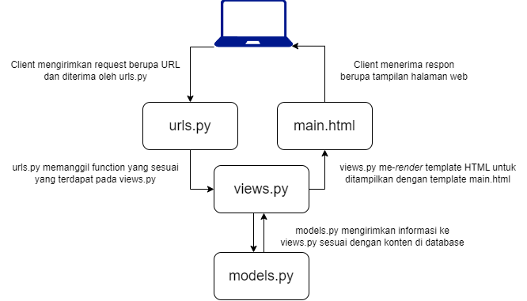

**Link Adaptable:** https://inventoire.adaptable.app  

1. Jelaskan bagaimana cara kamu mengimplementasikan checklist di atas secara step-by-step (bukan hanya sekadar mengikuti tutorial).  
Dalam mengerjakan checklist di atas, saya mulai dengan membuat project Django baru. Pertama-tama, saya membuat direktori utama yang bernama inventoire. Selanjutnya, saya membuat dan mengaktifkan virtual environment melalui command prompt. Kemudian, di dalam direktori utama, saya membuat file `requirements.txt` yang berisi dependencies aplikasi saya dan menginstall semuanya. Lalu, saya sudah bisa membuat project Django baru dengan command `django-admin startproject inventoire`. Variabel `ALLOWED_HOSTS` pada file settings.py saya assign value nya dengan ["*"] untuk keperluan deployment di Adaptable. Sekarang, saya membuat aplikasi main di dalam proyek inventoire dan menambahkan 'main' ke dalam variabel `INSTALLED_APPS` pada file settings.py. File models.py diisi dengan atribut name, amount, dan description dengan menyesuaikan tipenya masing-masing. Fungsi pada file views.py dibuat dengan menambahkan pasangan key nama dan kelas dan value yang berisi nama lengkap dan kelas PBP saya. Routing aplikasi main pada file urls.py dilakukan dengan membuat perintah baru untuk memproses routing ke main. Untuk deployment ke Adaptable dilakukan mirip seperti tutorial, tetapi yang berbeda adalah deployment berjalan dengan lancar, tidak seperti sewaktu tutorial.  

2. Buatlah bagan yang berisi request client ke web aplikasi berbasis Django beserta responnya dan jelaskan pada bagan tersebut kaitan antara urls.py, views.py, models.py, dan berkas html.  
  

3. Jelaskan mengapa kita menggunakan virtual environment? Apakah kita tetap dapat membuat aplikasi web berbasis Django tanpa menggunakan virtual environment?  
Virtual environment digunakan untuk mengisolasi dependencies dari project yang kita kerjakan agar tidak tercampur dengan dependencies dari project lain. Kita tetap dapat membuat aplikasi web berbasis Django tanpa menggunakan virtual environment, tetapi terdapat risiko tercampurnya dependencies antar project yang terdapat pada komputer kita yang bisa menimbulkan banyak masalah. Jadi, sangat disarankan untuk menggunakan virtual environment ketika bekerja dalam project Django.  

4. Jelaskan apakah itu MVC, MVT, MVVM dan perbedaan dari ketiganya.  
  - MVC
    - Model: mengelola database;
    - View: menyajikan tampilan informasi berupa Graphical User Interface (GUI) kepada user;
    - Controller: menghubungkan model dan view.

  - MVT
    - Model: mengelola database;
    - View: menerima request dan mengembalikan respons yang sesuai;
    - Template: mengatur user interface dan menyusun tampilan yang datanya diisi oleh model dan view.

  - MVVM
    - Model: mengelola database;
    - View: menentukan tata letak elemen-elemen yang akan dilihat oleh user;
    - ViewModel: melakukan interaksi dengan model dan meneruskan data ke bagian view.  
    MVC menggunakan controller sebagai pengatur logika aplikasi. MVT menggunakan Template untuk mengatur logika serta mengembalikan tampilan aplikasi. MVVM   menggunakan ViewModel untuk mengatur logika aplikasi.
